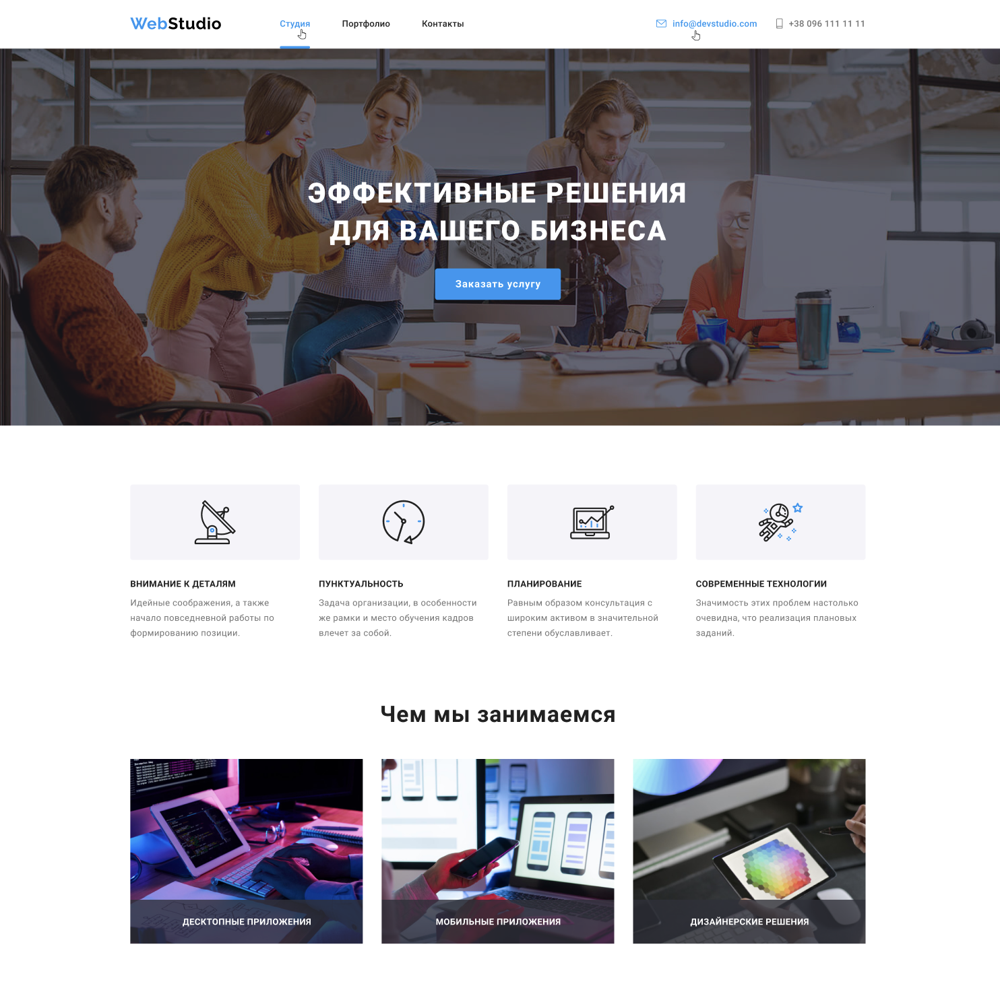

# Web Studio

## Project Description

**Web Studio** is a responsive web application designed to showcase web design projects. It allows users to explore various projects, view details, and connect with developers through an intuitive and visually appealing interface.

### Establish Your Online Presence

## Technologies

### This project is created using **HTML**, **SCSS**, **JavaScript**, and employs the following technologies and methods:

- **HTML5**: Utilizing modern semantic tags for content structuring.
- **SCSS (Sass)**: A CSS preprocessor for easier management and organization of styles.
- **Modal Windows**: Interactive interface elements to enhance user experience.
- **Forms**: Dynamic web forms for collecting user data with validation confirmation.
- **Retina-Supported Images**: Using high-quality images for high-resolution displays.
- **Semantic Markup**: Enhancing accessibility and SEO optimization through semantic HTML5.
- **SEO Optimization**: Implementing practices to improve visibility in search engines.
- **CSS Animations**: Utilizing animations to enhance visual appeal and user interaction.

### Key Features

- **Project Gallery**: A visually appealing display of web design projects with images and descriptions.
- **Project Details**: Users can click on any project to view more detailed information.
- **Feedback Form**: Users can fill out a form to contact developers for inquiries or collaboration.
- **Project Filtering**: Allows users to filter projects by categories or tags.
- **Responsive Layout**: Ensures that the application looks great on desktops, tablets, and mobile devices.

## License

This project is copyrighted and cannot be distributed for commercial purposes without written permission from the author. You may use, copy, and modify it, but you are not allowed to distribute or sell this project for commercial purposes.

For copyright details, see the [COPYRIGHT.txt](public/COPYRIGHT.txt) file.

## Contacts

For collaboration or inquiries, please reach out to me:

- **Maryna Nazina**: [nzyame@gmail.com]
- **GitHub**: [[GitHub Maryna Nazina](https://github.com/nazinamari)]

/------------------------------------------------------------------------------/

# Web Studio

## Опис проекту

**Web Studio** — це респонсивний веб-додаток, призначений для демонстрації веб-дизайнерських проектів. Він дозволяє користувачам досліджувати різні проекти, переглядати деталі та зв’язуватися з розробниками через інтуїтивно зрозумілий та візуально привабливий інтерфейс.

### Створіть свою онлайн присутність

## Технології

### Цей проект створений за допомогою **HTML**, **SCSS**, **JavaScript** та використовує наступні технології та методи:

- **HTML5**: Використання сучасних семантичних тегів для структуризації контенту.
- **SCSS (Sass)**: Препроцесор CSS для зручнішого управління стилями та їх організації.
- **Модальні вікна**: Інтерактивні елементи інтерфейсу для підвищення зручності користування.
- **Форми**: Динамічні веб-форми для збору даних користувачів з підтвердженням валідації.
- **Зображення з підтримкою Retina**: Використання високоякісних зображень для дисплеїв з високою роздільною здатністю.
- **Семантична верстка**: Підвищення доступності та SEO-оптимізації за допомогою семантичного HTML5.
- **SEO-оптимізація**: Реалізація практик для поліпшення видимості у пошукових системах.
- **CSS-анімації**: Використання анімацій для покращення візуальної привабливості та взаємодії з користувачем.

### Основні функції

- **Галерея проектів**: Візуально привабливий показ веб-дизайнерських проектів із зображеннями та описами.
- **Деталі проекту**: Користувачі можуть натиснути на будь-який проект, щоб переглянути більш детальну інформацію.
- **Форма зворотного зв'язку**: Користувачі можуть заповнити форму, щоб зв’язатися з розробниками для запитів або співпраці.
- **Фільтрація проектів**: Дозволяє користувачам фільтрувати проекти за категоріями або тегами.
- **Адаптивний макет**: Забезпечує, щоб додаток виглядав чудово на настільних комп'ютерах, планшетах та мобільних пристроях.

## Ліцензія

Цей проект має копірайт і не може бути розповсюджений у комерційних цілях без письмового дозволу автора. Ви можете використовувати, копіювати та модифікувати його, але не маєте права розповсюджувати чи продавати цей проект у комерційних цілях.

Деталі копірайту дивіться у файлі [COPYRIGHT.txt](public/COPYRIGHT.txt).

## Контакти

Для співпраці чи запитів, будь ласка, зв’яжіться зі мною:

- **Марина Назіна**: [nzyame@gmail.com]
- **GitHub**: [[GitHub Maryna Nazina](https://github.com/nazinamari)]
